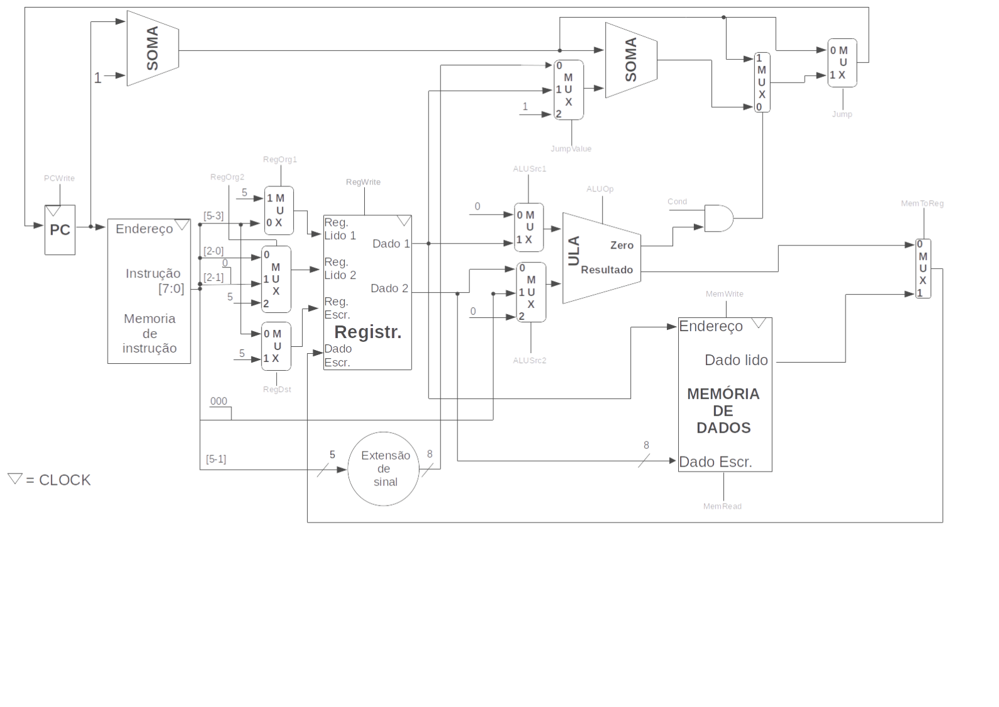
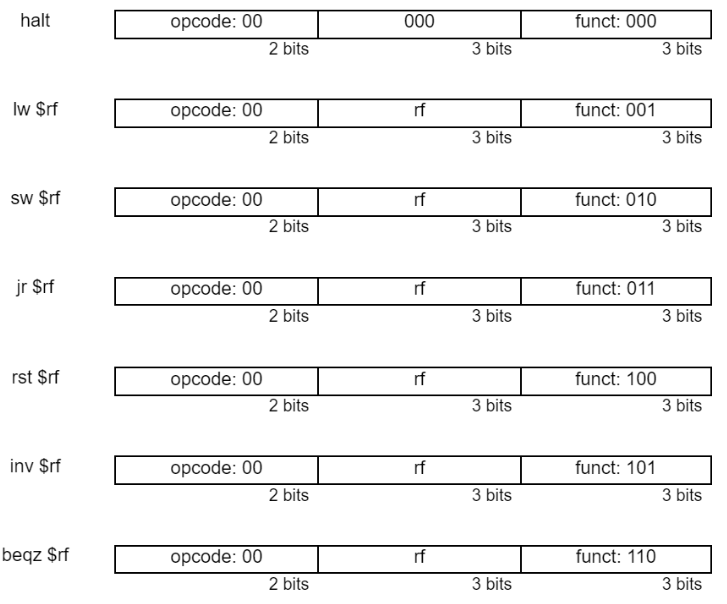
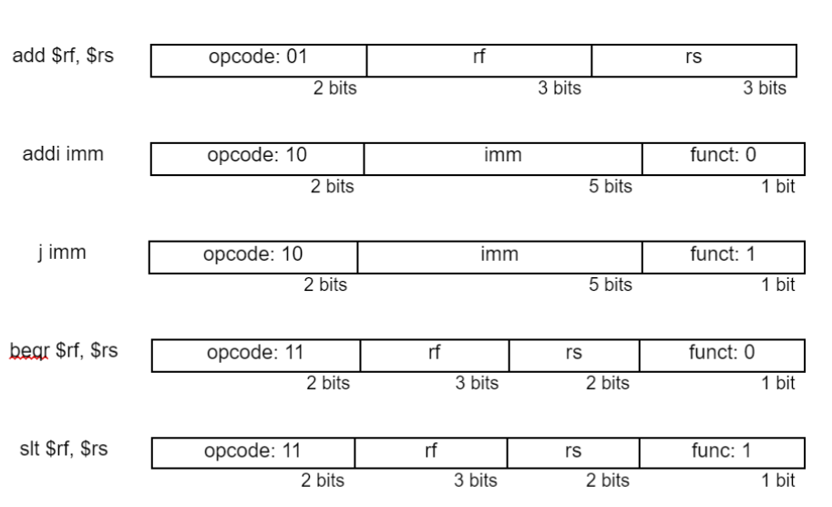

<h1>Introduction</h1>
<ul style="list-style-type: disc;">
    <li>Projeto de um processador de 8 bits criado durante as aulas de Laboratório de Arquitetura e Organização de Computadores 1</li>
    <li>Baseado na arquitetura MIPS de 32 bits</li>
</ul> 

<h1>Datapath</h1>

 

<h1>Instruction Models</h1>

    
        

 

<h1>Executing</h1>
<ul style="list-style-type: disc;">
    <li>Instruções do programa devem ser inseridas em "instrucoes.txt" em binário de acordo com os modelos de instrução providos anteriormente.</li>
    <li>Caso o programa tenha menos de 256 linhas de execução, preencher as restantes com "halt" em binário.</li>
    <li>Caso seja necessário que certos dados estejam previamente existentes na memória, preenchê-los no arquivo "assets/dados.txt".</li>
    <li>Executar programa: make run</li>
</ul>
 
    
<h1>Integrantes</h1>
<table>
    <tr>
        <td align="center">
            <a href="https://github.com/PedroRonzani18">
                
                 
                
                    <b>Pedro Ronzani</b>
                
            </a>
        </td>
        <td align="left">
            
PedroRonzani18 –
                <a href="https://outlook.live.com/mail/0/deeplink/compose?mailtouri=mailto%3Apedroaugustogabironzani%40hotmail.com">
                    pedroaugustogabironzani@hotmail.com
                </a>
            

        </td>
    </tr>
    <tr>
        <td align="center">
            <a href="https://github.com/zulisses">
                
                 
                
                    <b>Ulisses Carvalho</b>
                
            </a>
        </td>
        <td align="left">
            
zulisses –
                <a href="https://outlook.live.com/mail/0/deeplink/compose?mailtouri=mailto%3Agfulisses3%40gmail.com">
                    gfulisses3@gmail.com
                </a>
            

        </td>
    </tr>
    <tr>
        <td align="center">
            <a href="https://github.com/LucasAbrandao">
                
                 
                
                    <b>Lucas Brandao</b>
                
            </a>
        </td>
        <td align="left">
            
 LucasAbrandao –
                <a href="https://outlook.live.com/mail/0/deeplink/compose?mailtouri=mailto%3Aandradelucasbrandao%40gmail.com">
                    andradelucasbrandao@gmail.com
                </a>
            

        </td>

</table>